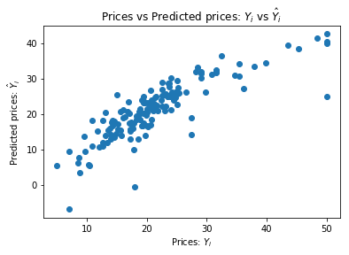

```python
import numpy as np
import pandas as pd
import scipy.stats as stats
import matplotlib.pyplot as plt
import sklearn
from sklearn.datasets import load_boston
from sklearn.linear_model import LinearRegression
from sklearn.model_selection import train_test_split
from sklearn.metrics import mean_squared_error , r2_score
```


```python
boston = load_boston()
bos = pd.DataFrame(boston.data)
```


```python
bos.head(10)
```


<div>
<style scoped>
    .dataframe tbody tr th:only-of-type {
        vertical-align: middle;
    }

    .dataframe tbody tr th {
        vertical-align: top;
    }

    .dataframe thead th {
        text-align: right;
    }
</style>
<table border="1" class="dataframe">
  <thead>
    <tr style="text-align: right;">
      <th></th>
      <th>0</th>
      <th>1</th>
      <th>2</th>
      <th>3</th>
      <th>4</th>
      <th>5</th>
      <th>6</th>
      <th>7</th>
      <th>8</th>
      <th>9</th>
      <th>10</th>
      <th>11</th>
      <th>12</th>
    </tr>
  </thead>
  <tbody>
    <tr>
      <th>0</th>
      <td>0.00632</td>
      <td>18.0</td>
      <td>2.31</td>
      <td>0.0</td>
      <td>0.538</td>
      <td>6.575</td>
      <td>65.2</td>
      <td>4.0900</td>
      <td>1.0</td>
      <td>296.0</td>
      <td>15.3</td>
      <td>396.90</td>
      <td>4.98</td>
    </tr>
    <tr>
      <th>1</th>
      <td>0.02731</td>
      <td>0.0</td>
      <td>7.07</td>
      <td>0.0</td>
      <td>0.469</td>
      <td>6.421</td>
      <td>78.9</td>
      <td>4.9671</td>
      <td>2.0</td>
      <td>242.0</td>
      <td>17.8</td>
      <td>396.90</td>
      <td>9.14</td>
    </tr>
    <tr>
      <th>2</th>
      <td>0.02729</td>
      <td>0.0</td>
      <td>7.07</td>
      <td>0.0</td>
      <td>0.469</td>
      <td>7.185</td>
      <td>61.1</td>
      <td>4.9671</td>
      <td>2.0</td>
      <td>242.0</td>
      <td>17.8</td>
      <td>392.83</td>
      <td>4.03</td>
    </tr>
    <tr>
      <th>3</th>
      <td>0.03237</td>
      <td>0.0</td>
      <td>2.18</td>
      <td>0.0</td>
      <td>0.458</td>
      <td>6.998</td>
      <td>45.8</td>
      <td>6.0622</td>
      <td>3.0</td>
      <td>222.0</td>
      <td>18.7</td>
      <td>394.63</td>
      <td>2.94</td>
    </tr>
    <tr>
      <th>4</th>
      <td>0.06905</td>
      <td>0.0</td>
      <td>2.18</td>
      <td>0.0</td>
      <td>0.458</td>
      <td>7.147</td>
      <td>54.2</td>
      <td>6.0622</td>
      <td>3.0</td>
      <td>222.0</td>
      <td>18.7</td>
      <td>396.90</td>
      <td>5.33</td>
    </tr>
    <tr>
      <th>5</th>
      <td>0.02985</td>
      <td>0.0</td>
      <td>2.18</td>
      <td>0.0</td>
      <td>0.458</td>
      <td>6.430</td>
      <td>58.7</td>
      <td>6.0622</td>
      <td>3.0</td>
      <td>222.0</td>
      <td>18.7</td>
      <td>394.12</td>
      <td>5.21</td>
    </tr>
    <tr>
      <th>6</th>
      <td>0.08829</td>
      <td>12.5</td>
      <td>7.87</td>
      <td>0.0</td>
      <td>0.524</td>
      <td>6.012</td>
      <td>66.6</td>
      <td>5.5605</td>
      <td>5.0</td>
      <td>311.0</td>
      <td>15.2</td>
      <td>395.60</td>
      <td>12.43</td>
    </tr>
    <tr>
      <th>7</th>
      <td>0.14455</td>
      <td>12.5</td>
      <td>7.87</td>
      <td>0.0</td>
      <td>0.524</td>
      <td>6.172</td>
      <td>96.1</td>
      <td>5.9505</td>
      <td>5.0</td>
      <td>311.0</td>
      <td>15.2</td>
      <td>396.90</td>
      <td>19.15</td>
    </tr>
    <tr>
      <th>8</th>
      <td>0.21124</td>
      <td>12.5</td>
      <td>7.87</td>
      <td>0.0</td>
      <td>0.524</td>
      <td>5.631</td>
      <td>100.0</td>
      <td>6.0821</td>
      <td>5.0</td>
      <td>311.0</td>
      <td>15.2</td>
      <td>386.63</td>
      <td>29.93</td>
    </tr>
    <tr>
      <th>9</th>
      <td>0.17004</td>
      <td>12.5</td>
      <td>7.87</td>
      <td>0.0</td>
      <td>0.524</td>
      <td>6.004</td>
      <td>85.9</td>
      <td>6.5921</td>
      <td>5.0</td>
      <td>311.0</td>
      <td>15.2</td>
      <td>386.71</td>
      <td>17.10</td>
    </tr>
  </tbody>
</table>
</div>


```python
target = pd.DataFrame(boston.target)
```


```python
target.head(10)
```


<div>
<style scoped>
    .dataframe tbody tr th:only-of-type {
        vertical-align: middle;
    }

    .dataframe tbody tr th {
        vertical-align: top;
    }

    .dataframe thead th {
        text-align: right;
    }
</style>
<table border="1" class="dataframe">
  <thead>
    <tr style="text-align: right;">
      <th></th>
      <th>0</th>
    </tr>
  </thead>
  <tbody>
    <tr>
      <th>0</th>
      <td>24.0</td>
    </tr>
    <tr>
      <th>1</th>
      <td>21.6</td>
    </tr>
    <tr>
      <th>2</th>
      <td>34.7</td>
    </tr>
    <tr>
      <th>3</th>
      <td>33.4</td>
    </tr>
    <tr>
      <th>4</th>
      <td>36.2</td>
    </tr>
    <tr>
      <th>5</th>
      <td>28.7</td>
    </tr>
    <tr>
      <th>6</th>
      <td>22.9</td>
    </tr>
    <tr>
      <th>7</th>
      <td>27.1</td>
    </tr>
    <tr>
      <th>8</th>
      <td>16.5</td>
    </tr>
    <tr>
      <th>9</th>
      <td>18.9</td>
    </tr>
  </tbody>
</table>
</div>


```python
X_train,X_test,y_train,y_test = train_test_split(bos,target,test_size=0.3,random_state=42)
```


```python
regressor = LinearRegression()
```


```python
regressor.fit(X_train,y_train)
```


    LinearRegression(copy_X=True, fit_intercept=True, n_jobs=1, normalize=False)


```python
boston_pred = regressor.predict(X_test)
```


```python
print("mse = %.2f" %(mean_squared_error(boston_pred,y_test)))
```

    mse = 21.54
    


```python
print("variance = %.2f" %(r2_score(boston_pred,y_test)))
```

    variance = 0.67
    

# Ideally, the scatter plot should create a linear line. Since the model does not fit 100%, the scatter plot is not creating a linear line.


```python
plt.scatter(y_test, boston_pred)
plt.xlabel("Prices: $Y_i$")
plt.ylabel("Predicted prices: $\hat{Y}_i$")
plt.title("Prices vs Predicted prices: $Y_i$ vs $\hat{Y}_i$")
plt.show()
```




